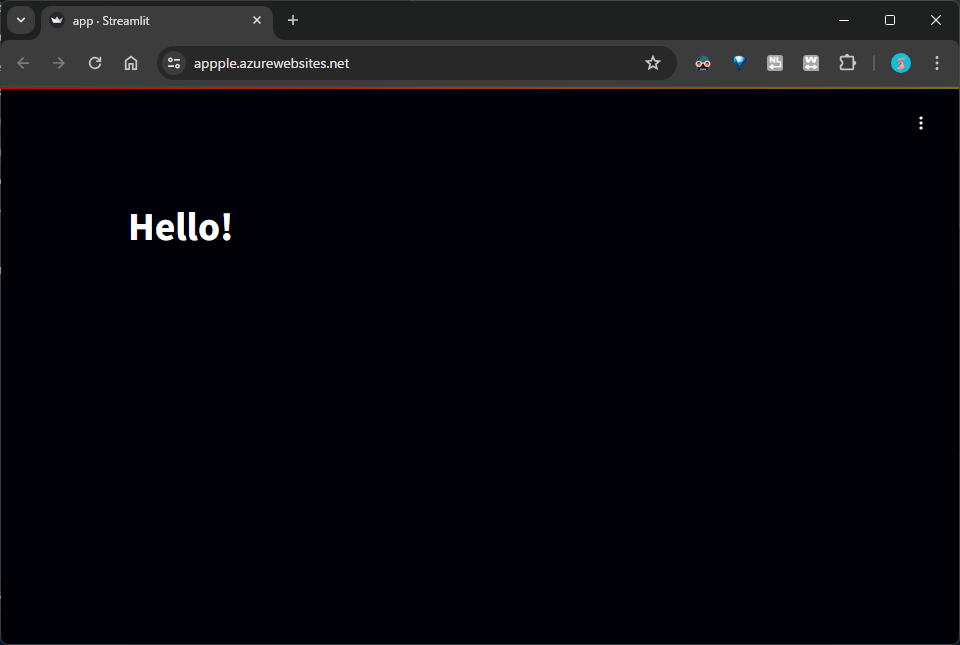

# Azure Streamlit Deploy

参考：[Streamlit を Azure App Serviceで動かす！](https://qiita.com/takashiuesaka/items/491b21e9afb34bbb6e6d)

* 注意点
    * ランタイムスタックに Python を設定する
    * `設定` > `構成` > `プラットフォームの設定` で `SCM 基本認証の発行資格情報` をオンにする

* workflow の失敗
    * 以下のサイトを見て GitHub との接続を切ったりしてみた
    * 最終的にもう一度 `構成` を保存して workflow を再実行したら通った
    * 何が原因解決につながったのかは不明
    * https://stackoverflow.com/questions/72280118/deployment-failed-with-error-package-deployment-using-zip-deploy-failed-refer
    * https://learn.microsoft.com/en-us/troubleshoot/azure/devops/failure-scenarios-related-azure-web-app-tasks

